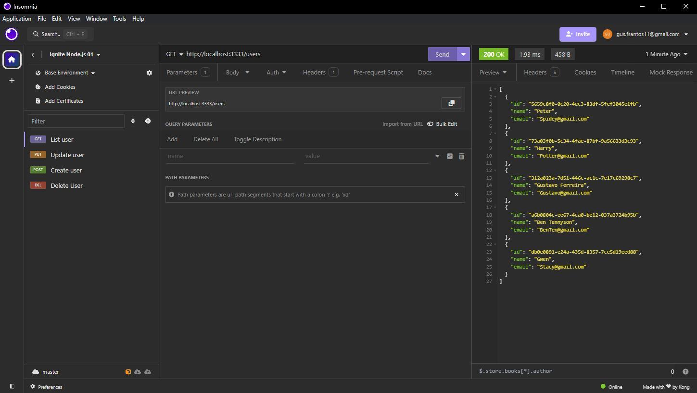

<h1 align="center"> Sistema de Usuários </h1>

Programa com Node.js e JavaScript, utilizando um banco de dados local.  

 

  

## 🚀 Tecnologias

Esse projeto foi desenvolvido com as seguintes tecnologias:

- Node.js
- JavaScript
- Git e Github
- Insomnia

## 💻 Projeto

O Sistema de usuários é um programa que armazena ID, Nome e Email do User, e tem funcionalidades de GET, POST, DELETE e PUT, sendo possível até fazer filtragem de dados. Onde não foi utilizado nenhum framework, com o próposito de conhecer melhor a ferramenta, foi meu primeiro projeto usando Node.js

---